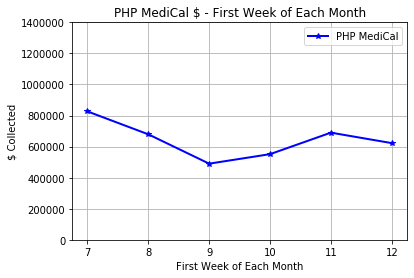

# Healthcare Data Analysis based on Bank Activities from the Second half of last year (2021).

## Overview:
Purpose of this analysis is to show my boss how the trends look like per payer names. 
We have so many different payer types and we are receiving moneys from them every month, but we want to know when they send us ACH $ amounts and
how much it would be for weekly basis. My boss wants to know that information specifically so that he can foresee how much we will have in our balance in total
and how much we are actually able to spend. It does not have to the perfect reconciled numbers so I ran SQL and Python to get the trends and to get rough numbers
to foresee. 

## Results: Only conducted this analysis with the data from July 2021 to December 2021.
### Reminder: Defined each week based on 
It could be not very accurate regression analysis but let's see what we can find out from this analysis!

* First Week of each month: 
    * The dollar amounts that we collected were floating around between $400,000 and $850,000.
    * The number from the first week of September 2021 was the lowest.

